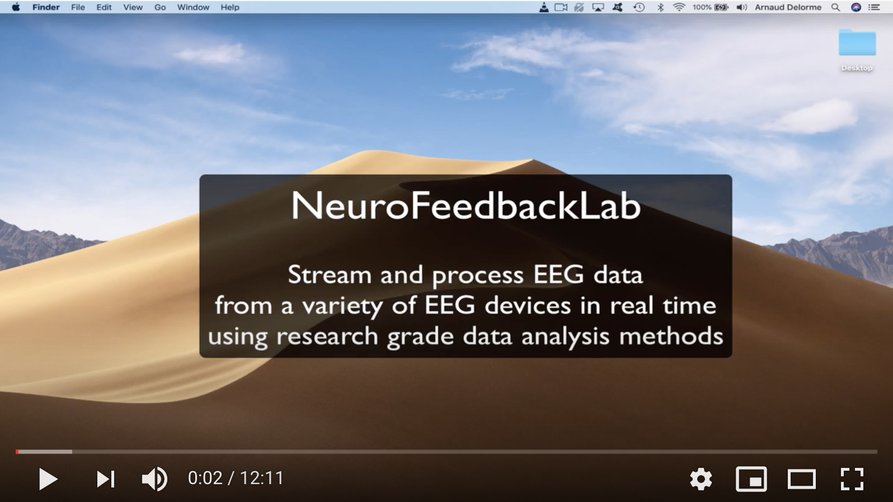

# Neurofeedbacklab

A Neurofeedback software approach based on Matlab. There is no graphical interface, so it is mostly for neurofeedback research purposes, or for neurofeedback expert who do not fear to change settings in text files.

# Tutorial videos
- Demo above https://www.youtube.com/watch?v=Mx3kf1MpAns
- Neurofeedback parameters https://youtu.be/hGiupsdwMi4
- Participants during actual experiment https://youtu.be/7lrMgpV1FSI

# Dependencies

- Matlab (including student versions)
- Matlab psychophysics toolbox http://psychtoolbox.org/ if you want visual feedback (other options available)
- BCILAB https://sccn.ucsd.edu/wiki/BCILAB

# Features

- Stream real time EEG signal using LSL and process it in real time
- Compute measure of interest, provide visual feedback or stream results through TCP/IP connection to other program.
- In a typical use, the same computer runs the data acquisition and performs visual feedback. 
- Adaptive filtering with minimum phase distortion
- Automated artifact rejection using Artifact Subspace Reconstruction. This methods uses PCA to find artifactual sections of data, then reconstruct a clean signal based on the statistics of the basline. https://sccn.ucsd.edu/~scott/pdf/Mullen_BCI13.pdf
- Apply spatial filter (independent component analysis)
- Spectral decomposition - tapered FFT - and selection of frequency bands of interest
- Save raw data and all transformed measures (spectral decomposition, feedback) in Matlab files for each subject
- Import the saved data in EEGLAB (scripts available upon request but not included in this project)
- Allow blinded protocol where data from a session from one subject is used for another subject (the data from the sham subject is recorded as if he was doing the task but the feedback from another subject is shownn).
- Run n sessions over m days. The first session of each day is always a baseline used for artifact rejection below.
- Manage subjects and track subjects' progress. Track human errors by checking that new sessions are preceeded by existing previous sessions. Made as much human proof as possible.

# Hardware

Any EEG system supported by LSL (this includes BIOSEMI, EGI, Neuroscan, Brainproducts, Emotiv, Cognionics, Enobio, Muse etc...). See the full list at https://github.com/sccn/labstreaminglayer/wiki/SupportedDevices.wiki. Allow using ADR101 board (http://www.ontrak.net/adr101.htm) if you want to be able to send events from the presentation computer to the EEG system. These boards translate serial information to parallel that can be used with EEG systems. Plan for a relatively powerfull multi-core computer to perform both data acquisition and feedback. The current program was used with a BIOSEMI 64-channel system and a 4-core Dell workstation with 8Gb of RAM.

# Feedback

Visual feedback is handled by the free Matlab Psychophysics toolbox (http://psychtoolbox.org/). Assuming that 2 screens are connected to the same PC, one screen for the experimenter and one screen for the participant. Can also be set up a single screen program that the experimenter and participant share. Default visual feedback is simple (for a session is visible see https://youtu.be/7lrMgpV1FSI) but can be tailored to any user need.

Auditory feedback has not been programmed yet in the Matlab version, but may be implemented by users as needed.

Feedback through a third party program is implemented through TCP/IP communication. An example of client is provided in simple_client.m. To use this client, start 2 sessions of Matlab. Edit the nfblab_options.m program and set the variablem "runmode" to "slave", then run nfblab_process which will then for a connection from a client. In the separate session run the simple_client program. The program can change all the options for the nfblab_process program including the LSL stream name.

# Platform

Tested on Windows, Mac and Ubuntu. 

# Publication

This program was used to collect data on 24 subjects in a double blinded protocol (12 neurofeedback and 12 controls). 192 sessions were recorded. The publication is pending. An example of a session is visible here https://youtu.be/7lrMgpV1FSI.

# Install the program

See the [INSTALL.md](INSTALL.md) documentation.

# Computer settings
- Set up your screen resolution and screen settings. This program is made to be run on 2 screens, one screen for the subject and one screen for the expertimenter. For technical reasons, it is always better to set your primary screen as the screen for the subject (otherwise the psychophysics toolbox might not work properly).
- Disable visual buffering in Matlab. Create an icon on the desktop for Matlab. Look at properties - compatibility tab. Disable "Desktop composition" and "Disable display scaling on high DPI setttings".
- Go to your graphic card properties (display settings and select your graphic card). If you do not have graphic properties, then do not worry about this step. Disable tripple buferring, double buffering and any other fancy option (3-D etc...).

# Program settings
Program settings are contained in the file [nfblab_options.m](src/nfblab_options.m). Parameters are explained below.

## General parameters
- psychoToolbox (true/false), Toggle to false for testing without psych toolbox
- adrBoard      (true/false), Toggle to true if using ADR101 board to send events to the EEG amplifier

## LSL connection parameters
- lsltype (string), put to empty if you cannot connect to your system
- lslname (string), this is the name of the stream that shows in Lab Recorder f empty, it will only use the type above. USE lsl_resolve_byprop(lib, 'type', lsltype, 'name', lslname) to connect to the stream. If you cannot connect nfblab won't be able to connect either.

## sessions parameters
- baselineSessionDuration (integer), duration of baseline in second (the baseline is used to train the artifact removal ASR function)
- sessionDuration (integer), regular sessions - here 5 minutes
- ntrials (integer), number of trials per day
- ndays   (integer), number of days of training

## data acquisition parameters
- nchans  (integer), number of channels with data
- chans   (integer), indices of channels with data
- mask    (floating point array), patial filter for feedback (here used channel 1). May be an ICA component or complex spatial filter.

## data processing parameters
- srateHardware (integer), sampling rate of the hardware
- srate         (integer), sampling rate for processing data (must divide srateHardware)
- windowSize (integer), length of window size for FFT (if equal to srate then 1 second)
- nfft       (integer), length of FFT - allows FFT padding if necessary
- windowInc  (integer), window increment - in this case update every 1/4 second

## feedback parameters
- theta   [min max]. Frequency range of interest. This program does not allow inhibition at other frequencies although it could be modified to do so
- maxChange  (value from 0 to 1). Cap for change in feedback between processed windows every 1/4 sec. feedback is between 0 and 1 so this is 5% here
- dynRange     [min max]. Initial power range in dB
- dynRangeInc  (value from 0 to 1). Increase in dynamical range in percent if the power value is outside the range (every 1/4 sec)
- dynRangeDec  (value from 0 to 1). Decrease in dynamical range in percent if the power value is within the range (every 1/4 sec)

# Compile the program (so it does not require Matlab)

See the [COMPILE.md](COMPILE.md) documentation.

